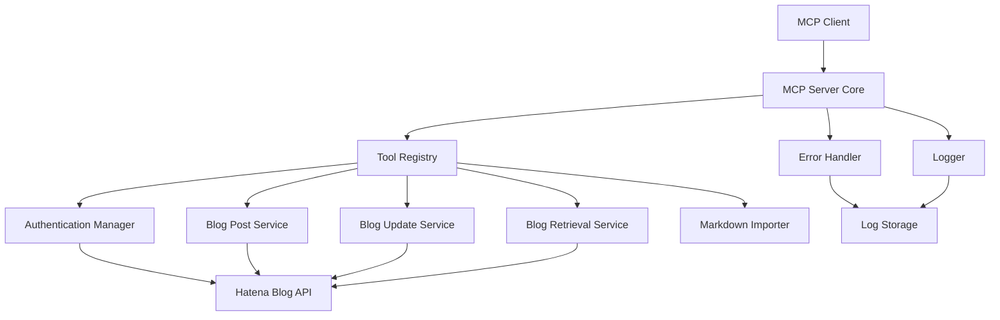
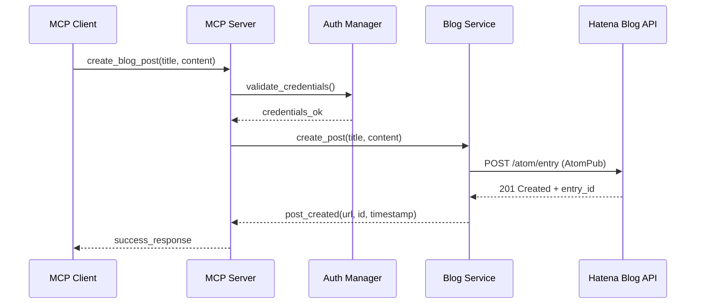
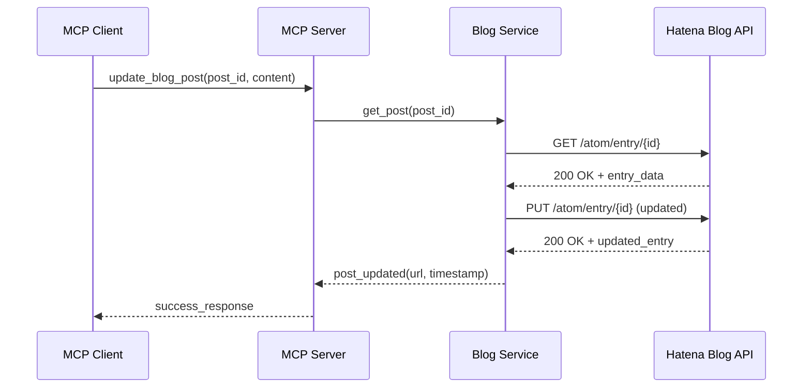
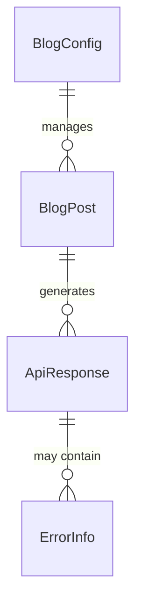
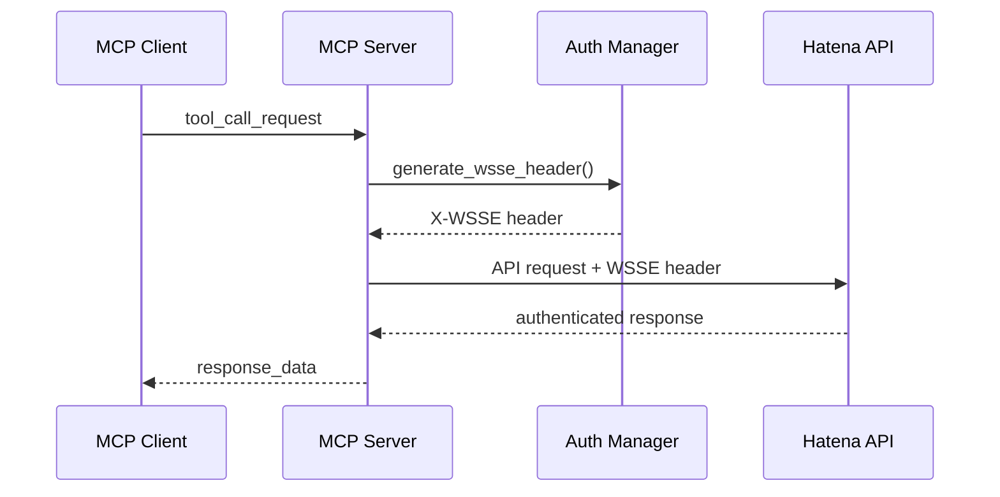

# Technical Design

## Overview
はてなブログMCPサーバーは、MCPプロトコルを介してはてなブログAPIと連携する Python製サーバーです。AtomPub プロトコルを使用したはてなブログAPIとのHTTP通信をMCPツールとして抽象化し、AIアシスタントが直感的にブログ操作を実行できるインターフェースを提供します。

## Requirements Mapping

### Design Component Traceability
各設計コンポーネントは特定の要件に対応しています：

- **MCP Server Core** → REQ-1: MCPサーバー基盤
- **Authentication Manager** → REQ-2: 認証・設定管理
- **Blog Post Service** → REQ-3: 記事投稿機能
- **Blog Update Service** → REQ-4: 記事更新機能
- **Blog Retrieval Service** → REQ-5: 記事情報取得機能
- **Error Handler & Logger** → REQ-6: エラーハンドリング・ログ機能
- **Performance Monitor** → REQ-7: 技術仕様・パフォーマンス

### User Story Coverage
要件定義からの全ユーザーストーリーに対応：

- **AI Assistant Story**: MCPプロトコル経由でのブログ操作実行
- **Blog Author Story**: 認証情報設定による安全なAPI access
- **System Administrator Story**: 包括的なエラーハンドリングとログ機能
- **System Integrator Story**: Python/uv技術スタック要件への準拠

## Architecture



### Technology Stack
調査結果に基づく技術選定：

- **Core Framework**: Python 3.12 + uv パッケージマネージャー
- **MCP Protocol**: `mcp` (Anthropic公式SDK)
- **HTTP Client**: `httpx` (非同期対応、AtomPub API通信)
- **XML Processing**: `lxml` (AtomPub XMLパース・生成、互換性のため `<6` を使用)
- **Configuration**: `pydantic-settings` (型安全な設定管理)
- **Logging**: `loguru` (構造化ログ出力)
- **Testing**: `pytest` + `pytest-asyncio` (非同期テスト対応)
 - **Markdown**: `markdown`（HTML変換） + `python-frontmatter`（YAML Front Matter 解析）

### Architecture Decision Rationale
主要技術選定の根拠：

- **Why Python 3.12**: MCP SDKサポート、最新の型ヒント機能、豊富なライブラリ
- **Why uv**: 高速依存関係解決、開発効率向上、要件準拠
- **Why httpx**: 非同期HTTP通信、AtomPub APIとの高効率通信
- **Why lxml**: AtomPub XMLの堅牢なパース、名前空間処理対応
- **Why pydantic-settings**: 型安全な設定管理、環境変数統合

## Data Flow

### Primary User Flows
主要なデータフロー：

#### 1. 記事投稿フロー


#### 2. 記事更新フロー


## Components and Interfaces

### Backend Services & Method Signatures

#### MCP Server Core
```python
class HatenaBlogMCPServer:
    def __init__(self, config: ServerConfig) -> None:
        """MCPサーバーの初期化"""
    
    async def start(self) -> None:
        """サーバー起動、MCP接続受付開始"""
    
    async def handle_tool_call(self, tool_name: str, parameters: dict) -> dict:
        """MCPツール呼び出し処理"""
```

#### Authentication Manager
```python
class AuthenticationManager:
    def __init__(self, config: AuthConfig) -> None:
        """認証マネージャー初期化"""
    
    def validate_credentials(self) -> bool:
        """認証情報の妥当性検証"""
    
    def get_auth_headers(self) -> dict:
        """WSSE認証ヘッダー生成"""
```

#### Blog Post Service
```python
class BlogPostService:
    def __init__(self, auth_manager: AuthenticationManager) -> None:
        """記事サービス初期化"""
    
    async def create_post(self, title: str, content: str, categories: list[str] = None) -> BlogPost:
        """新規記事投稿"""
    
    async def update_post(self, post_id: str, title: str = None, content: str = None) -> BlogPost:
        """記事更新"""
    
    async def get_post(self, post_id: str) -> BlogPost:
        """記事取得"""
    
    async def list_posts(self, limit: int = 10) -> list[BlogPost]:
        """記事一覧取得"""
```

#### Markdown Importer
```python
class MarkdownImporter:
    def __init__(self, *, enable_front_matter: bool = True) -> None:
        """Markdown取り込みとFront Matter解析"""

    def load_from_file(self, path: str) -> BlogPost:
        """.mdファイルからBlogPostを構築（contentはHTML）"""

    def convert(self, markdown_text: str, *, filename: str | None = None) -> BlogPost:
        """Markdownテキスト + 任意のファイル名からBlogPostを構築"""
```

### MCP Tools Interface
MCPクライアントに公開されるツール：

| Tool Name | Purpose | Parameters | Returns |
|-----------|---------|------------|---------|
| create_blog_post | 新規記事投稿 | title: str, content: str, categories: list[str] | post_url: str, post_id: str, created_at: str |
| update_blog_post | 記事更新 | post_id: str, title: str, content: str | post_url: str, updated_at: str |
| get_blog_post | 記事取得 | post_id: str | title: str, content: str, categories: list[str] |
| list_blog_posts | 記事一覧取得 | limit: int | posts: list[BlogPost] |

#### Optional Tools (Markdown)
| Tool Name | Purpose | Parameters | Returns |
|-----------|---------|------------|---------|
| create_blog_post_from_markdown | Markdownから新規記事投稿 | path: str | post_url: str, post_id: str, created_at: str |

## Data Models

### Domain Entities
1. **BlogPost**: ブログ記事エンティティ
2. **BlogConfig**: ブログ設定・認証情報
3. **ApiResponse**: API応答結果
4. **ErrorInfo**: エラー情報

### Entity Relationships


### Data Model Definitions

```python
@dataclass
class BlogPost:
    id: str
    title: str
    content: str
    categories: list[str]
    published: bool
    created_at: datetime
    updated_at: datetime
    url: str

@dataclass
class BlogConfig:
    user_id: str
    blog_id: str
    api_key: str
    base_url: str = "https://blog.hatena.ne.jp"

@dataclass
class ApiResponse:
    success: bool
    data: dict
    error_info: Optional[ErrorInfo] = None
    http_status: int = 200

@dataclass
class ErrorInfo:
    error_code: str
    error_message: str
    retry_after: Optional[int] = None
```

### AtomPub XML Schema
はてなブログAPIとの通信に使用するXML構造：

```xml
<?xml version="1.0" encoding="utf-8"?>
<entry xmlns="http://www.w3.org/2005/Atom" xmlns:app="http://www.w3.org/2007/app">
    <title>記事タイトル</title>
    <content type="text/html">記事本文</content>
    <category term="カテゴリ1" />
    <category term="カテゴリ2" />
    <app:control>
        <app:draft>no</app:draft>
    </app:control>
</entry>
```

## Error Handling

### Error Categories
エラーの分類と処理方針：

1. **認証エラー (AUTH_ERROR)**
   - 不正な認証情報
   - APIキー期限切れ
   - 処理: 設定確認を促すメッセージ

2. **API制限エラー (RATE_LIMIT)**
   - API呼び出し制限到達
   - 処理: 指数バックオフによる自動リトライ

3. **ネットワークエラー (NETWORK_ERROR)**
   - 接続タイムアウト
   - DNS解決失敗
   - 処理: 最大3回の自動リトライ

4. **データエラー (DATA_ERROR)**
   - 必須パラメータ不足
   - 無効な記事ID
   - 処理: 詳細なエラーメッセージ返却

### Error Handling Implementation
```python
class ErrorHandler:
    async def handle_api_error(self, error: Exception) -> ApiResponse:
        """API エラーの統一処理"""
        if isinstance(error, AuthenticationError):
            return self._handle_auth_error(error)
        elif isinstance(error, RateLimitError):
            return self._handle_rate_limit_error(error)
        elif isinstance(error, NetworkError):
            return self._handle_network_error(error)
        else:
            return self._handle_generic_error(error)
```

## Security Considerations

### Authentication & Authorization
WSSE認証を使用したセキュアなAPI通信：



### Data Protection（シンプル化されたアプローチ）
**基本方針**: セキュリティよりもシンプルさを優先
- **API Key Protection**: プレーンテキストファイル（`.env`）による管理
- **Transport Security**: HTTPS通信（はてなブログAPIの標準）
- **Input Validation**: 基本的な型チェックのみ
- **Credential Storage**: ローカルファイルに平文保存（開発用途優先）

### Security Best Practices（実用的なアプローチ）
- **Simple Configuration**: 設定ファイルの直接編集による認証情報管理
- **Rate Limiting**: はてなブログAPI制限への準拠のみ
- **Basic Logging**: 認証情報を含む詳細ログは出力
- **Error Transparency**: 詳細なエラー情報を表示（デバッグ優先）

**セキュリティ vs シンプルさのトレードオフ**:
- ✅ **開発効率**: 設定が簡単、デバッグが容易
- ✅ **実装コスト**: セキュリティ層の実装不要
- ❌ **セキュリティリスク**: 認証情報の平文保存
- ❌ **プロダクション適用**: そのままでは本番環境不適合

## Performance & Scalability

### Performance Targets
| Metric | Target | Measurement |
|--------|--------|-------------|
| Server Startup | < 10 seconds | 初期化時間 |
| API Response (p95) | < 2 seconds | はてなブログAPI応答時間 |
| Memory Usage | < 100MB | 通常運用時メモリ使用量 |
| Concurrent Connections | > 10 | 同時MCP接続数 |

### Caching Strategy
- **Configuration Cache**: 起動時設定読み込み、メモリキャッシュ
- **API Response Cache**: 記事取得結果の短期間キャッシュ（5分）
- **Error State Cache**: エラー状態の一時保存（リトライ制御）

### Scalability Approach
- **Asynchronous Processing**: asyncio による非同期処理
- **Connection Pooling**: httpx connection pool による効率的HTTP通信
- **Resource Management**: 適切なリソース解放とガベージコレクション

## Testing Strategy

### Test Coverage Requirements
- **Unit Tests**: ≥85% code coverage
- **Integration Tests**: 全MCPツールとはてなブログAPI連携
- **Error Scenario Tests**: 全エラーケースのテスト
- **Performance Tests**: パフォーマンス要件の検証

### Testing Approach

#### Unit Testing
```python
class TestBlogPostService:
    async def test_create_post_success(self):
        """正常な記事投稿のテスト"""
        
    async def test_create_post_auth_error(self):
        """認証エラーのテスト"""
        
    async def test_create_post_rate_limit(self):
        """API制限エラーのテスト"""
```

#### Integration Testing
- **MCP Protocol Integration**: MCPクライアントとの通信テスト
- **Hatena API Integration**: はてなブログAPIとの連携テスト
- **Configuration Integration**: 設定管理の統合テスト

#### Performance Testing
```python
class TestPerformance:
    async def test_startup_time(self):
        """10秒以内の起動時間確認"""
        
    async def test_memory_usage(self):
        """100MB以下のメモリ使用量確認"""
        
    async def test_concurrent_requests(self):
        """同時リクエスト処理性能"""
```

### CI/CD Pipeline


## Deployment & Operations

### Project Structure
```
hatena-blog-mcp-server/
├── pyproject.toml          # uv依存関係定義（mcp[cli]を含む）
├── .github/
│   └── workflows/
│       └── claude-code.yml # GitHub Actions設定（参考：zenn_mcp_dev）
├── src/
│   └── hatena_blog_mcp/
│       ├── __init__.py
│       ├── server.py       # MCP Server Core
│       ├── auth.py         # Authentication Manager
│       ├── blog_service.py # Blog Post Service
│       ├── models.py       # Data Models
│       └── config.py       # Configuration
├── tests/
│   ├── unit/
│   ├── integration/
│   └── performance/
├── docs/
│   └── github-actions-setup.md # GitHub Actions設定ガイド
└── .env.example           # 環境変数テンプレート

# Remote Repository: https://github.com/YusukeHayashiii/hatena-mcp-server
```

### Configuration Management

**初期設定（インタラクティブ作業が必要）**:
サーバー初回起動時には、ユーザーが以下の認証情報を直接設定する必要があります：
- **はてなユーザーID**: はてなアカウントのユーザーID
- **ブログID**: 対象ブログの識別子（ブログURLから取得）
- **APIキー**: はてなブログの設定画面から取得するAPIキー

これらの情報は、`.env`ファイルまたは環境変数として設定し、セキュアに管理されます。

```python
class ServerConfig(BaseSettings):
    hatena_user_id: str  # 必須：ユーザーが手動設定
    hatena_blog_id: str  # 必須：ユーザーが手動設定  
    hatena_api_key: str  # 必須：ユーザーが手動設定
    log_level: str = "INFO"
    max_retries: int = 3
    request_timeout: int = 30
    
    class Config:
        env_file = ".env"
```

**設定手順**:
1. はてなブログの設定画面でAPIキーを生成・取得
2. ブログのURLからブログIDを特定
3. `.env`ファイルに認証情報を記載
4. MCPサーバーを起動し、認証情報の妥当性を確認

## Authentication Implementation Strategy

### Primary Approach: Simple Configuration File
**既存の実装パターンを踏襲**したシンプルな認証方式:

```python
# .env ファイル例（プレーンテキスト保存）
HATENA_USER_ID=your_username
HATENA_BLOG_ID=your_blog_id
HATENA_API_KEY=your_api_key_here
```

この方式は以下の理由で広く使用されています：
- **GitHub Actions Secrets**: 環境変数による機密情報管理
- **Docker Compose**: `.env`ファイルによる設定注入
- **多くのOSSプロジェクト**: 設定ファイル直接編集方式

### Contingency Plans（コンチプランオプション）

#### Option 1: Interactive Setup Script（推奨）
```python
# setup.py - 初回セットアップスクリプト
def interactive_setup():
    print("はてなブログMCPサーバー初期設定")
    user_id = input("はてなユーザーID: ")
    blog_id = input("ブログID: ")
    api_key = input("APIキー: ")
    
    with open('.env', 'w') as f:
        f.write(f"HATENA_USER_ID={user_id}\n")
        f.write(f"HATENA_BLOG_ID={blog_id}\n")
        f.write(f"HATENA_API_KEY={api_key}\n")
```

#### Option 2: JSON Configuration File
```json
// config.json - 多くのNode.jsプロジェクトで使用される方式
{
  "hatena": {
    "user_id": "your_username",
    "blog_id": "your_blog_id", 
    "api_key": "your_api_key_here"
  },
  "server": {
    "log_level": "INFO",
    "max_retries": 3
  }
}
```

#### Option 3: INI Configuration File
```ini
# config.ini - Python標準ライブラリで簡単に読み込める方式
[hatena]
user_id = your_username
blog_id = your_blog_id
api_key = your_api_key_here

[server]
log_level = INFO
max_retries = 3
```

#### Option 4: Command Line Arguments
```bash
# CLI引数方式 - 一回限りの実行に適している
python -m hatena_blog_mcp \
  --user-id your_username \
  --blog-id your_blog_id \
  --api-key your_api_key_here
```

### Implementation Priority
1. **Primary**: `.env`ファイル方式（最もシンプル）
2. **Fallback**: Interactive setup script（ユーザーフレンドリー）
3. **Alternative**: JSON設定ファイル（構造化データ）
4. **Development**: CLI引数方式（テスト用途）

### Code Example: Flexible Configuration Loading
```python
class FlexibleConfig:
    def load_config(self):
        # Priority 1: Environment variables
        if all([os.getenv('HATENA_USER_ID'), os.getenv('HATENA_BLOG_ID'), os.getenv('HATENA_API_KEY')]):
            return self._load_from_env()
        
        # Priority 2: .env file
        elif os.path.exists('.env'):
            return self._load_from_dotenv()
        
        # Priority 3: JSON config file
        elif os.path.exists('config.json'):
            return self._load_from_json()
        
        # Priority 4: Interactive setup
        else:
            return self._interactive_setup()
```

この多段階フォールバック方式により、様々な環境と使用パターンに対応可能です。

### Monitoring & Logging
- **Structured Logging**: JSON形式でのログ出力
- **Performance Metrics**: 応答時間、メモリ使用量の監視
- **Error Tracking**: エラー発生率とパターンの追跡
- **Health Check**: サーバー状態監視エンドポイント